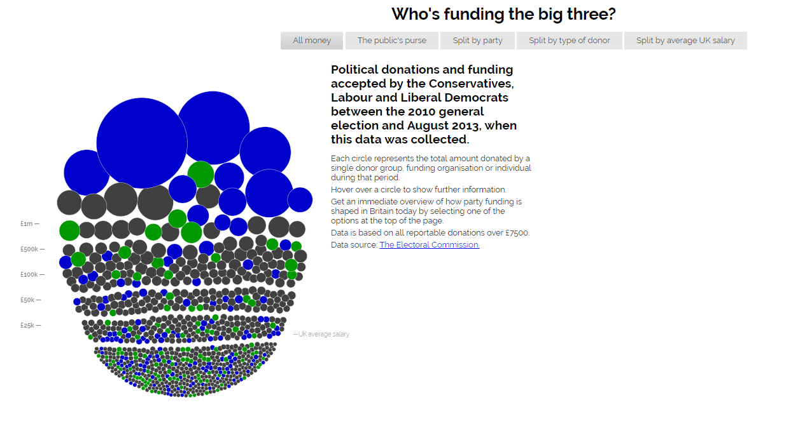
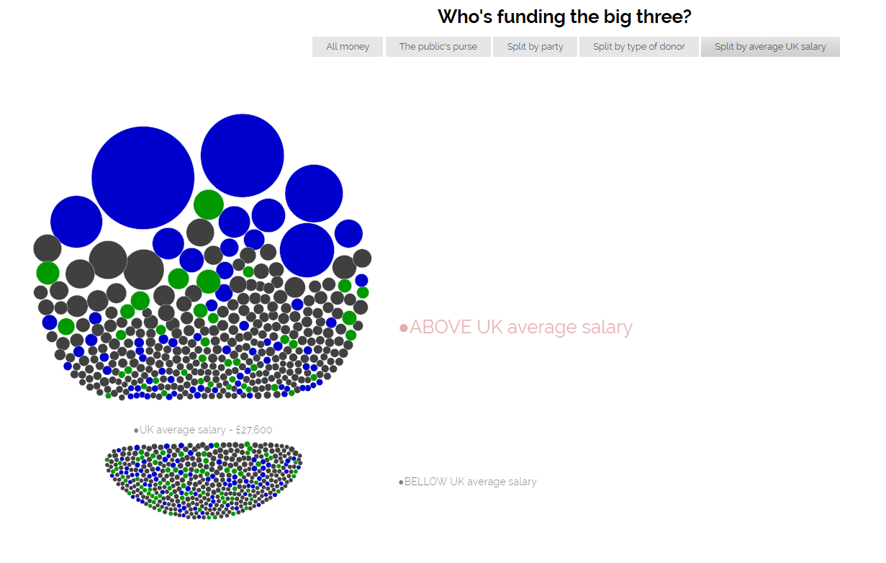
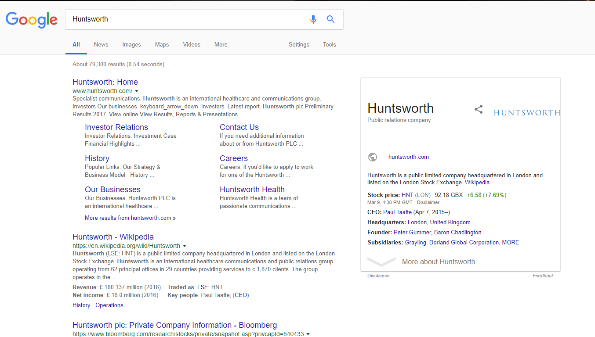
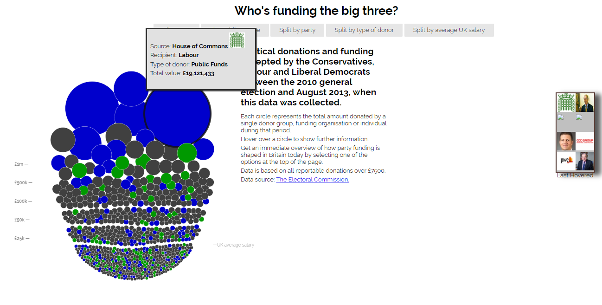
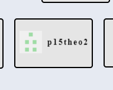

# Οπτικοποίηση Δεδομένων Χορηγιών (UK)

## ΤΕΛΙΚΗ ΑΝΑΦΟΡΑ (9 ΜΑΪΟΥ)
* Ονοματεπώνυμο Φοιτητή:  Σπύρος Θεοδώροπουλος
* Αριθμός Μητρώου: **Π2015035**
* Θέμα Εργασίας: **Οπτικοποίηση Δεδομένων Χορηγιών (UK) - Data Visualization**
* Προσωπικό αποθετήριο του κώδικα: [Link Αποθετηρίου του κώδικα](https://github.com/p15theo2/D3js-uk-political-donations)
* Link για το εκτελέσιμο: [Link Εκτελέσιμου](https://p15theo2.github.io/D3js-uk-political-donations/)

# ΣΥΝΟΨΗ

Η παρούσα εργασία αποτελεί εργασία εξαμήνου στο μάθημα "Τεχνολογία Λογισμικού".  Σκοπός της εργασίας ηταν να ολοκληρωθούν τα ζητουμενα όπως αναφέρονται στα παραδοτεα 1 και 2. Στόχος της εργασίας είναι η εκμαθηση του χρήστη γύρω από το κομμάτι της html, της javascript και css.

# ΑΝΑΛΥΣΗ ΣΧΕΤΙΚΩΝ ΕΡΓΩΝ & ΕΡΓΑΛΕΙΩΝ

Τα κύρια εργαλεία που χρησιμοποιήθηκαν ειναι το github και το brackets για την επεξεργασια του κωδικα

# ΜΕΘΟΔΟΣ ΚΑΙ ΤΕΧΝΙΚΕΣ ΑΝΑΠΤΥΞΗΣ

## Παραδοτέο 1:

Για το πρώτο παραδοτέο, πραγματοποίησα ολα τα ζητούμενα της εργασίας.

### Υλοποίηση Ερωτημάτων στο Αποθετήριό μου

<or>
  <li>Σύνδεσμος Εργασίας (gh-pages): https://p15theo2.github.io/D3js-uk-political-donations/</li>
  <li>Αλλαξα το όνομα του .html αρχείου σε <b>index.html</b> για να λειτουργεί το site χωρίς την κατάληξη σε full-viz.html</li>
  <li>Άλλαξα τα χρώματα του γραφήματος</li>
  <li>Πρόσθεσα ήχο κάθε φορά που ο χρήστης πατάει κάποιο απο τα κουμπιά</li>
  <li>Κάθε φορά που ο χρήστης πατάει πάνω σε κάποιον κύκλο του γραφήματος ανοίγει ένα παράθυρο με αποτελέσματα αναζήτησης του αντίστοιχου δωρητή</li>
  <li>Όποτε ο χρήστης τοποθετει το ποντικι πάνω από κείμενο της σελίδας, γίνεται zoom πάνω σε αυτό το κομμάτι κειμένου</li>
  <li>Επιπλέον όποτε ο χρήστης τοποθετει το ποντικι πάνω από έναν κύκλο του γραφήματος, το όνομα και το ποσό της δωρεάς προφέρεται με τεχνολογία text-to-speech</li>
  <li>Δημιούργησα μια επιπλέον επιλογή κατηγοριοποίησης <b>Split by UK average salary</b> η οποια τοποθετει τις μπαλλες αναλογα με τον μεσο ετησιο μισθο.</li>
</or>

### Υλοποίηση Ερωτημάτων στο κοινό Αποθετήριο

<or>
  <li>Πρόσθεσα και έκανα pull request το αρχείο .csv με τα στοιχεία μου το οποίο έγινε merge</li>
  <li>Πρόσθεσα 5 καινούργιες φωτογραφίες για τα παρακάτω πρόσωπα-εταιρίες:<ul>
        <li>Co-operative Group</li>
        <li>Co-operative Party</li>
        <li>FIL Investment Management</li>
        <li>Gloucester Research</li>
        <li>Berkeley Burke</li>
        </ul></li>
</or>

### Εικόνες:

## Παραδοτέο 2: Tελικό έργο - 25% (9 Μαϊου)

Για το δεύτερο παραδοτέο, πραγματοποίησα 2 από τα 5 ζητούμενα της εργασίας.

### Υλοποίηση Ερωτημάτων στο Αποθετήριό μου

1) Αρχικά ζητήθηκε να εμφανίζεται η σειρά των εικόνων με τους δωρητές πάνω από τους οποίους πέρασε ο δείκτης του ποντικιού στο γράφημα.

### Υλοποίηση Ερωτημάτων στο κοινό Αποθετήριο

3) Τέλος για τοο τελευταίο ζητούμενο που υλοποίησα δεύσμευσα την περιοχη "position #025" και πραγματοποιήθηκαν οι κατάλληλες αλλαγές στον κώδικα, ώστε να κινειται το κειμενο με εναν μοναδικο κειμενο.

# ΣΥΜΠΕΡΑΣΜΑΤΑ

Πρόκειται για μια ενδιαφέρουσα εργασία η οποία ειδικα απο τα πρωτα ζητουμενα καλει τον φοιτητη να ανακαλυψει τον κόσμο του προγραματισμου ιστοσελίδων . Απο το πρωτο παραδοτεο συμπληρωσα ολα τα ζητούμενα κάτι το οποιο δυστηχώς δεν μπόρεσα να κάνω και στο δέυτερο παραδοτεο λόγω της υπερβολικης δυσκολιας καθως και της αδυναμιας ευρεσης βοηθειας στο ιντερνετ για τοσο εξεζητημενα ζητηματα .
Οπως και να έχει η εργάσια αποτελούσε μια καλη δοκιμασία πάνω σε ενα πολύ σημαντικo κομμάτι της πληροφορικής

# ΧΡΗΣΙΜΟΙ ΣΥΝΔΕΣΜΟΙ
https://stackoverflow.com/
https://pages.github.com/
https://d3js.org/
http://brackets.io/

